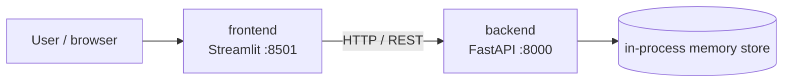

# Cool People List — deployment exercise

A small two-service web app (FastAPI backend + Streamlit frontend) used to practice containerization and image publishing.

---

## Table of contents

1. [Purpose and context](#purpose-and-context)
2. [Requirements → implementation map](#requirements--implementation-map)
3. [Architecture](#architecture)
4. [Tech stack](#tech-stack)
5. [REST API endpoints](#rest-api-endpoints)
6. [Service addresses and API docs](#service-addresses-and-api-docs)
7. [Environment variables](#environment-variables)
8. [Running locally](#running-locally)
9. [Docker / Docker Compose](#docker--docker-compose)
10. [Image versioning policy](#image-versioning-policy)
11. [Testing](#testing)
12. [Repository structure](#repository-structure)

---

## Purpose and context

This project is a deployment ("wdrożeniowe") exercise. The application itself is intentionally simple — a list of people with a "swag level" that can be joined and left — so the focus stays on the deployment side: splitting an app into independent services, containerizing each one, wiring them together with Docker Compose, and publishing versioned images to a registry.

---

## Requirements → implementation map

| Requirement | Implementation |
|---|---|
| **REST API (FastAPI)** | [backend/main.py](FirstApplication/backend/main.py) — `POST/GET/DELETE /people` endpoints, async handlers, auto-generated OpenAPI/Swagger docs |
| **Data validation (Pydantic)** | [backend/models.py](FirstApplication/backend/models.py) — `PersonIn`/`PersonOut`/`DeleteRequest`, field validators (non-empty names, no digits, birth date not in the future, swag level range, min password length), automatic `422` on invalid input |
| **HTTP methods + status codes** | `POST /people` (201/422), `GET /people`, `GET /people/{id}` (404 if missing), `DELETE /people/{id}` (403 on wrong password, 404 if missing) |
| **Frontend UI** | [frontend/frontend.py](FirstApplication/frontend/frontend.py) — Streamlit form + table, talks to the backend only via REST (`API_URL`) |
| **Password handling** | Passwords are hashed with PBKDF2-HMAC-SHA256 + per-user salt in [backend/main.py](FirstApplication/backend/main.py); the plain password is never stored or returned |
| **Containerization (Docker)** | Independent [backend/Dockerfile](FirstApplication/backend/Dockerfile) and [frontend/Dockerfile](FirstApplication/frontend/Dockerfile), orchestrated by [docker-compose.yml](FirstApplication/docker-compose.yml) |
| **Configuration via environment variables** | `API_URL` env var wires the frontend to the backend (see [Environment variables](#environment-variables)) |
| **Image publishing** | Images are built and pushed to a private container registry (build/publish steps intentionally not documented here) |
| **Image versioning** | SemVer tags (`vMAJOR.MINOR.PATCH`) + `latest` (see [Image versioning policy](#image-versioning-policy)) |

---

## Architecture

The application is made of two independent services, run as separate containers and talking to each other over a Docker network:



- **backend** ([FirstApplication/backend](FirstApplication/backend)) — stores people's data in process memory (a plain Python dict). There is no persistent database, so data is lost on container restart.
- **frontend** ([FirstApplication/frontend](FirstApplication/frontend)) — Streamlit UI, communicates with the backend exclusively through the REST API.

---

## Tech stack

| Layer | Technology | File |
|---|---|---|
| Backend HTTP | **FastAPI** + **Uvicorn** | [backend/main.py](FirstApplication/backend/main.py) |
| Validation | **Pydantic** | [backend/models.py](FirstApplication/backend/models.py) |
| Frontend | **Streamlit** + **requests** | [frontend/frontend.py](FirstApplication/frontend/frontend.py) |
| Containerization | **Docker** + **Docker Compose** | [backend/Dockerfile](FirstApplication/backend/Dockerfile), [frontend/Dockerfile](FirstApplication/frontend/Dockerfile), [docker-compose.yml](FirstApplication/docker-compose.yml) |

---

## REST API endpoints

| Method | Path | Description |
|---|---|---|
| `POST` | `/people` | Registers a new person on the list |
| `GET` | `/people` | Returns the list of all people |
| `GET` | `/people/{person_id}` | Returns a single person's data |
| `DELETE` | `/people/{person_id}` | Removes a person from the list (requires the correct password in the request body) |

---

## Service addresses and API docs

| Service | Local address | Description |
|---|---|---|
| Frontend | http://localhost:8501 | User interface (Streamlit) |
| Backend (API) | http://localhost:8000 | REST API (FastAPI) |
| API docs (Swagger UI) | http://localhost:8000/docs | Interactive documentation and endpoint testing |
| API docs (ReDoc) | http://localhost:8000/redoc | Alternative documentation view |

---

## Environment variables

| Variable | Service | Default | Description |
|---|---|---|---|
| `API_URL` | frontend | `http://127.0.0.1:8000` | Backend address the frontend sends HTTP requests to. Set to `http://backend:8000` in [docker-compose.yml](FirstApplication/docker-compose.yml) so the frontend can reach the backend by its service name on the Docker network. |

The backend currently requires no environment variables — its host and port are set directly in [backend/Dockerfile](FirstApplication/backend/Dockerfile) (`uvicorn main:app --host 0.0.0.0 --port 8000`).

---

## Running locally

### With Docker Compose

```powershell
cd FirstApplication
docker compose up
```

### Without Docker (two terminals)

```powershell
# terminal 1 — backend
cd FirstApplication/backend
pip install -r requirements.txt
uvicorn main:app --reload

# terminal 2 — frontend
cd FirstApplication/frontend
pip install -r requirements.txt
$env:API_URL = "http://127.0.0.1:8000"
streamlit run frontend.py
```

---

## Docker / Docker Compose

[docker-compose.yml](FirstApplication/docker-compose.yml) defines two services, `backend` and `frontend`, pulling pre-built images from a private container registry and exposing ports `8000` and `8501`. The frontend gets `API_URL=http://backend:8000` so it can reach the backend by service name on the Compose network.

Each service has its own single-stage [Dockerfile](FirstApplication/backend/Dockerfile) based on `python:3.13-slim`, which installs dependencies from `requirements.txt` and then copies the application source.

Build and publish steps (registry path, credentials) are intentionally not documented in this README.

---

## Image versioning policy

Images are tagged following [Semantic Versioning](https://semver.org/), in the format `vMAJOR.MINOR.PATCH`:

- **MAJOR** — breaking changes incompatible with the previous API version (e.g. an endpoint contract change).
- **MINOR** — new functionality that remains backward compatible.
- **PATCH** — bug fixes with no functional changes.

Each image is published with two tags: a specific version (e.g. `v1.2.0`) and `latest`, pointing to the newest stable version (used by default in [docker-compose.yml](FirstApplication/docker-compose.yml)).

The image version tag should match a corresponding tag/release in the Git repository, to make it easy to trace a given image back to the exact source commit.

---

## Testing

The project currently has no automated test suite — verification is done manually:

1. **Backend via Swagger UI** — after starting the app, open http://localhost:8000/docs and try out the endpoints (`POST /people`, `GET /people`, `GET /people/{id}`, `DELETE /people/{id}`).
2. **Backend via curl**, e.g.:
   ```powershell
   curl -X POST http://localhost:8000/people -H "Content-Type: application/json" -d '{"name":"John","surname":"Smith","date_of_birth":"2000-01-01","swag_level":1000,"password":"pass123"}'
   curl http://localhost:8000/people
   ```
3. **Frontend end-to-end** — open http://localhost:8501, add a person through the form, verify they appear on the list, then remove them using the password set at registration.
4. **Data validation** — verify the backend rejects invalid data (e.g. `swag_level` below 500, a future date of birth, a password shorter than 4 characters) with a `422` status code.

---

## Repository structure

```
FirstApplication/
├── docker-compose.yml       # backend + frontend services, ports, API_URL
├── backend/
│   ├── Dockerfile           # FastAPI + Uvicorn image
│   ├── main.py              # API endpoints, password hashing
│   ├── models.py            # Pydantic schemas + validators
│   └── requirements.txt
└── frontend/
    ├── Dockerfile           # Streamlit image
    ├── frontend.py          # UI: registration form + people table
    └── requirements.txt
```
