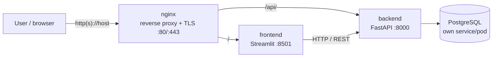

# Cool People List — deployment exercise

A small web app with a FastAPI backend and Streamlit frontend, deployed with nginx as a reverse proxy, used to practice containerization and image publishing during an internship.

---

## Table of contents

1. [Purpose and context](#purpose-and-context)
2. [Requirements → implementation map](#requirements--implementation-map)
3. [Architecture](#architecture)
4. [Tech stack](#tech-stack)
5. [REST API endpoints](#rest-api-endpoints)
6. [Service addresses and API docs](#service-addresses-and-api-docs)
7. [Environment variables](#environment-variables)
8. [Running locally](#running-locally)
9. [Docker / Docker Compose](#docker--docker-compose)
10. [Kubernetes (Docker Desktop)](#kubernetes-docker-desktop)
11. [Health checks](#health-checks)
12. [Reverse proxy and TLS (nginx)](#reverse-proxy-and-tls-nginx)
13. [Deployment workflow](#deployment-workflow)
14. [Image versioning policy](#image-versioning-policy)
15. [Testing](#testing)
16. [Continuous integration](#continuous-integration)
17. [Repository structure](#repository-structure)

---

## Purpose and context

This project is a deployment ("wdrożeniowe") exercise. The application itself is intentionally simple — a list of people with a "swag level" that can be joined and left — so the focus stays on the deployment side: splitting an app into independent services, containerizing each one, wiring them together with Docker Compose, and publishing versioned images to a registry.

---

## Requirements → implementation map

| Requirement | Implementation |
|---|---|
| **REST API (FastAPI)** | [backend/main.py](FirstApplication/backend/main.py) — `POST/GET/DELETE /people` endpoints, async handlers, auto-generated OpenAPI/Swagger docs |
| **Data validation (Pydantic)** | [backend/models.py](FirstApplication/backend/models.py) — `PersonIn`/`PersonOut`/`DeleteRequest`, field validators (non-empty names, no digits, birth date not in the future, swag level range, min password length, password must contain a letter and a number), automatic `422` on invalid input |
| **HTTP methods + status codes** | `POST /people` (200/422), `GET /people`, `GET /people/{id}` (404 if missing), `DELETE /people/{id}` (403 on wrong password, 404 if missing) |
| **Frontend UI** | [frontend/frontend.py](FirstApplication/frontend/frontend.py) — Streamlit form + table, talks to the backend only via REST (`API_URL`) |
| **Password handling** | Passwords are hashed with PBKDF2-HMAC-SHA256 + per-user salt in [backend/main.py](FirstApplication/backend/main.py); the plain password is never stored or returned |
| **Persistent storage (PostgreSQL)** | [backend/main.py](FirstApplication/backend/main.py) — connects to PostgreSQL via `POSTGRES_*` env vars; data persists in a named Docker volume (Compose) or a `StatefulSet`'s `PersistentVolumeClaim` (Kubernetes) |
| **Containerization (Docker)** | Independent multi-stage [backend/Dockerfile](FirstApplication/backend/Dockerfile) and [frontend/Dockerfile](FirstApplication/frontend/Dockerfile), orchestrated by [docker-compose.yml](FirstApplication/docker-compose.yml) |
| **Health checks / startup ordering** | `GET /health` on the backend and Streamlit's built-in `/_stcore/health`, wired into `HEALTHCHECK` in both Dockerfiles and `healthcheck:` + `depends_on: condition: service_healthy` in [docker-compose.yml](FirstApplication/docker-compose.yml) (see [Health checks](#health-checks)) |
| **Reverse proxy + TLS** | `nginx` service in [docker-compose.yml](FirstApplication/docker-compose.yml) using [nginx/nginx.conf](FirstApplication/nginx/nginx.conf) — single public entry point on `80`/`443`, HTTPS via a self-signed certificate (see [Reverse proxy and TLS (nginx)](#reverse-proxy-and-tls-nginx)) |
| **Configuration via environment variables** | `API_URL` and `POSTGRES_*` env vars (see [Environment variables](#environment-variables)) |
| **Image publishing** | Images are built and pushed to a private container registry (build/publish steps intentionally not documented here) |
| **Image versioning** | SemVer tags (`vMAJOR.MINOR.PATCH`) + `latest` (see [Image versioning policy](#image-versioning-policy)) |
| **Automated testing (CI)** | [.github/workflows/auto_tests.yml](.github/workflows/auto_tests.yml) — runs the pytest suite on every push/PR (see [Continuous integration](#continuous-integration)) |
| **Automated versioning/releases (CI)** | [.github/workflows/tagging.yml](.github/workflows/tagging.yml) — commit-message-driven SemVer tag + GitHub release on every push to `main` |
| **Deployment workflow (CI)** | [.github/workflows/deploy.yml](.github/workflows/deploy.yml) — on every push to `main`, pulls `POSTGRES_USER`/`POSTGRES_DB` (variables) and `POSTGRES_PASSWORD` (secret) from the `dev` GitHub Environment and runs `docker compose pull` + `docker compose up -d` (a TLS certificate must be present on the deployment host) |
| **Configuration via GitHub Environments** | The `dev` [GitHub Environment](https://docs.github.com/en/actions/deployment/targeting-different-environments/using-environments-for-deployment) holds the `POSTGRES_USER`/`POSTGRES_DB` variables and the `POSTGRES_PASSWORD` secret used by [deploy.yml](.github/workflows/deploy.yml) |
| **Container orchestration (Kubernetes)** | [FirstApplication/k8s](FirstApplication/k8s) — `Deployment`/`Service`/`ConfigMap` per app service, a `StatefulSet` + `PersistentVolumeClaim` for PostgreSQL, `Secret`s for credentials/TLS, targeting Docker Desktop's built-in cluster (see [Kubernetes (Docker Desktop)](#kubernetes-docker-desktop)) |

---

## Architecture

The application has two independent application services, run as separate containers and communicating over a Docker network. nginx provides the public entry point:


```mermaid
graph LR
    U[User / browser] -->|"http(s)://host"| N[nginx<br/>reverse proxy + TLS :80/:443]
    N -->|"/"| F[frontend<br/>Streamlit :8501]
    N -->|"/api/"| B[backend<br/>FastAPI :8000]
    F -- HTTP / REST --> B
    B --> D[(PostgreSQL<br/>own service/pod)]
```

- **nginx** ([FirstApplication/nginx](FirstApplication/nginx)) — reverse proxy and TLS termination point. It's the only service with ports published to the host (`80`/`443`); it forwards `/` to the frontend and `/api/` to the backend over the internal Docker network. See [Reverse proxy and TLS (nginx)](#reverse-proxy-and-tls-nginx).
- **backend** ([FirstApplication/backend](FirstApplication/backend)) — stores people's data in PostgreSQL, connecting via `POSTGRES_HOST`/`POSTGRES_PORT`/`POSTGRES_DB`/`POSTGRES_USER`/`POSTGRES_PASSWORD` env vars. Postgres itself runs as its own service/Pod (`postgres` in Compose, a `StatefulSet` in Kubernetes), persisting data in a named volume or `PersistentVolumeClaim` respectively — see [Docker / Docker Compose](#docker--docker-compose) and [Kubernetes (Docker Desktop)](#kubernetes-docker-desktop).
- **frontend** ([FirstApplication/frontend](FirstApplication/frontend)) — Streamlit UI, communicates with the backend exclusively through the REST API (over the internal Docker network, not through nginx).

---

## Tech stack

| Layer | Technology | File |
|---|---|---|
| Backend HTTP | **FastAPI** + **Uvicorn** | [backend/main.py](FirstApplication/backend/main.py) |
| Validation | **Pydantic** | [backend/models.py](FirstApplication/backend/models.py) |
| Storage | **PostgreSQL** (`psycopg2`) | [backend/main.py](FirstApplication/backend/main.py) |
| Frontend | **Streamlit** + **requests** | [frontend/frontend.py](FirstApplication/frontend/frontend.py) |
| Containerization | **Docker** + **Docker Compose** | [backend/Dockerfile](FirstApplication/backend/Dockerfile), [frontend/Dockerfile](FirstApplication/frontend/Dockerfile), [docker-compose.yml](FirstApplication/docker-compose.yml) |

---

## REST API endpoints

| Method | Path | Description |
|---|---|---|
| `POST` | `/people` | Registers a new person on the list |
| `GET` | `/people` | Returns the list of all people |
| `GET` | `/people/{person_id}` | Returns a single person's data |
| `DELETE` | `/people/{person_id}` | Removes a person from the list (requires the correct password in the request body) |
| `GET` | `/health` | Returns `{"status": "ok"}`; used by Docker/Compose health checks (see [Health checks](#health-checks)) |

---

## Service addresses and API docs

| Service | Local address | Description |
|---|---|---|
| Frontend | http://localhost:8501 (direct) / https://\<host\> (via nginx) | User interface (Streamlit) |
| Backend (API) | http://localhost:8000 (direct) / https://\<host\>/api/ (via nginx) | REST API (FastAPI) |
| API docs (Swagger UI) | http://localhost:8000/docs | Interactive documentation and endpoint testing |
| API docs (ReDoc) | http://localhost:8000/redoc | Alternative documentation view |
| Health check | http://localhost:8000/health, http://localhost:8501/_stcore/health | Used by Docker's `HEALTHCHECK`/Compose `healthcheck:` (see [Health checks](#health-checks)) |

When running via Docker Compose, `backend`/`frontend` no longer publish ports to the host directly (they use `expose:`, reachable only inside the Docker network) — nginx is the single public entry point. The `localhost:8000`/`:8501` addresses above only apply when running the services [without Docker](#without-docker-two-terminals).

---

## Environment variables

| Variable | Service | Default | Description |
|---|---|---|---|
| `API_URL` | frontend | `http://127.0.0.1:8000` | Backend address the frontend sends HTTP requests to. Set to `http://backend:8000` in [docker-compose.yml](FirstApplication/docker-compose.yml) so the frontend can reach the backend by its service name on the Docker network. |
| `POSTGRES_HOST` | backend | None; required | Hostname of the PostgreSQL server. Set to `postgres` in both [docker-compose.yml](FirstApplication/docker-compose.yml) and the Kubernetes manifests — the DNS name of the `postgres` service on the same network. |
| `POSTGRES_PORT` | backend | `5432` | Port PostgreSQL listens on. |
| `POSTGRES_DB` | backend | None; required | Name of the database the backend connects to; also read by the `postgres` container itself to create that database on first startup. |
| `POSTGRES_USER` | backend | None; required | Database role the backend authenticates as. |
| `POSTGRES_PASSWORD` | backend | None; required | Password for `POSTGRES_USER`. Sourced from a git-ignored `FirstApplication/.env` file locally, a `dev` GitHub Environment secret in CI (Compose), or a Kubernetes `Secret` named `postgres-credentials` (Kubernetes) — never committed. |

The backend's host and port are set directly in [backend/Dockerfile](FirstApplication/backend/Dockerfile) (`uvicorn main:app --host 0.0.0.0 --port 8000`).

---

## Running locally

### With Docker Compose

Create a git-ignored `FirstApplication/.env` file so Compose can resolve `${POSTGRES_USER}`/`${POSTGRES_PASSWORD}`/`${POSTGRES_DB}` (this mirrors the same-named variables/secret stored in the `dev` GitHub Environment, used the same way by [deploy.yml](.github/workflows/deploy.yml) in CI):

```
POSTGRES_USER=appuser
POSTGRES_PASSWORD=<a-real-password>
POSTGRES_DB=coolpeople
```

Generate a self-signed TLS certificate for nginx (one-time setup, or whenever it expires — see [Reverse proxy and TLS (nginx)](#reverse-proxy-and-tls-nginx) for details):

```powershell
mkdir FirstApplication\nginx\certs
docker run --rm -v "${PWD}\FirstApplication\nginx\certs:/certs" alpine/openssl req -x509 -nodes -days 365 -newkey rsa:2048 `
  -keyout /certs/selfsigned.key -out /certs/selfsigned.crt `
  -subj "/CN=<your-ip>" `
  -addext "subjectAltName=IP:<your-ip>"
```

Replace `<your-ip>` with `127.0.0.1` for local-only access, your machine's LAN IP (from `ipconfig`) for access from other devices on the network, or the server's public IP for a remote deployment.

Then:

```powershell
cd FirstApplication
docker compose up -d
docker compose ps
```

Wait until `backend` and `frontend` report `healthy` in `docker compose ps` (this can take a few seconds due to their `start_period`), then open `https://<your-ip>/` in the browser (accept the self-signed certificate warning). `http://<your-ip>/` redirects to `https://` automatically.

### Without Docker (two terminals)

```powershell
# terminal 0 — a local PostgreSQL instance for development (if you don't already have one running)
docker run --rm -e POSTGRES_USER=appuser -e POSTGRES_PASSWORD=<a-real-password> -e POSTGRES_DB=coolpeople -p 5432:5432 postgres:16

# terminal 1 — backend
cd FirstApplication/backend
pip install -r requirements.txt
$env:POSTGRES_HOST = "localhost"
$env:POSTGRES_PORT = "5432"
$env:POSTGRES_DB = "coolpeople"
$env:POSTGRES_USER = "appuser"
$env:POSTGRES_PASSWORD = "<a-real-password>"
uvicorn main:app --reload

# terminal 2 — frontend
cd FirstApplication/frontend
pip install -r requirements.txt
$env:API_URL = "http://127.0.0.1:8000"
streamlit run frontend.py
```

All five `POSTGRES_*` variables (except `POSTGRES_PORT`, which has no code default either but is conventionally `5432`) are required and must be set before the backend starts — the example above assumes a local PostgreSQL container reachable at `localhost:5432`.

---

## Docker / Docker Compose

[docker-compose.yml](FirstApplication/docker-compose.yml) defines four services: `postgres`, `backend`, `frontend`, and `nginx` — pulling pre-built images from a private container registry (`ghcr.io/juro-candf/zadania-wdrozeniowe-*`) for `backend`/`frontend`, and the official `postgres`/`nginx` images for the rest. `backend`/`frontend`/`postgres` only `expose` their ports (`8000`/`8501`/`5432`) to the internal Docker network — `nginx` is the only service with `ports:` published to the host (`80`/`443`). The frontend gets `API_URL=http://backend:8000` so it can reach the backend by service name on the Compose network. The backend gets `POSTGRES_HOST=postgres` plus `POSTGRES_PORT`/`POSTGRES_DB`/`POSTGRES_USER`/`POSTGRES_PASSWORD` so it can connect to the `postgres` service, and waits on Postgres's `pg_isready` healthcheck via `depends_on: condition: service_healthy` before starting. Postgres persists its data in the `postgresdata` named volume, so it survives container restarts and recreations.

Each service has its own multi-stage [Dockerfile](FirstApplication/backend/Dockerfile) based on `dhi.io/python:3.13-debian13-dev`: a `builder` stage creates a virtualenv and installs dependencies from `requirements.txt` with `--require-hashes` (pinned via `pip-compile`), then the final stage copies the venv and application source and runs the app from it.

Build and publish steps (registry path, credentials) are intentionally not documented in this README.

Pulling these images (locally or in CI) requires authenticating to the registry first, even when a package is public, e.g. `docker login ghcr.io -u <github-username>` with a PAT that has `read:packages` scope — otherwise `docker compose pull` can fail with an `error from registry: denied` response.

---

## Kubernetes (Docker Desktop)

As an alternative to Docker Compose, the same services can be run on Kubernetes — manifests live in [FirstApplication/k8s](FirstApplication/k8s), targeting the single-node cluster built into Docker Desktop (Settings → Kubernetes → Enable Kubernetes).

| File | Kind | Purpose |
|---|---|---|
| [backend-deployment.yaml](FirstApplication/k8s/backend-deployment.yaml) | `Deployment` | Runs the backend image; `POSTGRES_*` env vars from `backend-config`/`postgres-credentials`; readiness/liveness probes on `/health` |
| [backend-service.yaml](FirstApplication/k8s/backend-service.yaml) | `Service` (`ClusterIP`) | Internal DNS name `backend:8000` |
| [backend-configmap.yaml](FirstApplication/k8s/backend-configmap.yaml) | `ConfigMap` | Non-secret backend config: `POSTGRES_HOST`, `POSTGRES_PORT`, `POSTGRES_DB` |
| [backend-pvc.yaml](FirstApplication/k8s/backend-pvc.yaml) | `PersistentVolumeClaim` | Left over from an earlier SQLite-based setup; no longer mounted by `backend-deployment.yaml` now that Postgres owns storage — kept only for reference |
| [frontend-deployment.yaml](FirstApplication/k8s/frontend-deployment.yaml) | `Deployment` | Runs the frontend image; `API_URL` from `frontend-config`; probes on `/_stcore/health` |
| [frontend-service.yaml](FirstApplication/k8s/frontend-service.yaml) | `Service` (`ClusterIP`) | Internal DNS name `frontend:8501` |
| [frontend-configmap.yaml](FirstApplication/k8s/frontend-configmap.yaml) | `ConfigMap` | `API_URL: http://backend:8000` |
| [postgres-statefulset.yaml](FirstApplication/k8s/postgres-statefulset.yaml) | `StatefulSet` | Runs `postgres:16` with a dedicated `PersistentVolumeClaim` per replica via `volumeClaimTemplates`; credentials from `postgres-credentials` |
| [postgres-service.yaml](FirstApplication/k8s/postgres-service.yaml) | `Service` (headless, `clusterIP: None`) | Stable per-Pod DNS names required by the `StatefulSet` |
| [nginx-deployment.yaml](FirstApplication/k8s/nginx-deployment.yaml) | `Deployment` | Runs `nginx:latest`, mounting `nginx-config` and the `nginx-tls` secret |
| [nginx-service.yaml](FirstApplication/k8s/nginx-service.yaml) | `Service` (`LoadBalancer`) | Publishes `80`/`443` to the host — Docker Desktop binds this to `localhost` |
| [nginx-configmap.yaml](FirstApplication/k8s/nginx-configmap.yaml) | `ConfigMap` | Same reverse-proxy/TLS logic as [nginx/nginx.conf](FirstApplication/nginx/nginx.conf), adapted to reference Kubernetes `Service` DNS names/ports |

Two `Secret`s hold real credentials/certificates and are created imperatively rather than committed as YAML:

```powershell
kubectl create secret generic postgres-credentials `
  --from-literal=POSTGRES_USER=appuser `
  --from-literal=POSTGRES_PASSWORD=<a-real-password> `
  --from-literal=POSTGRES_DB=coolpeople

kubectl create secret tls nginx-tls `
  --cert=FirstApplication/nginx/certs/selfsigned.crt `
  --key=FirstApplication/nginx/certs/selfsigned.key
```

Apply everything (this order lets PVCs/Secrets exist before the Pods that reference them, though `kubectl apply -f FirstApplication/k8s/` for the whole folder at once also works — Kubernetes retries scheduling until dependencies appear):

```powershell
kubectl apply -f FirstApplication/k8s/postgres-service.yaml
kubectl apply -f FirstApplication/k8s/postgres-statefulset.yaml
kubectl apply -f FirstApplication/k8s/backend-configmap.yaml
kubectl apply -f FirstApplication/k8s/backend-deployment.yaml
kubectl apply -f FirstApplication/k8s/backend-service.yaml
kubectl apply -f FirstApplication/k8s/frontend-configmap.yaml
kubectl apply -f FirstApplication/k8s/frontend-deployment.yaml
kubectl apply -f FirstApplication/k8s/frontend-service.yaml
kubectl apply -f FirstApplication/k8s/nginx-configmap.yaml
kubectl apply -f FirstApplication/k8s/nginx-deployment.yaml
kubectl apply -f FirstApplication/k8s/nginx-service.yaml
```

Then open `https://localhost/` (accept the self-signed certificate warning), same as the Compose deployment.

Two gotchas specific to this path:

- Editing a `ConfigMap` does **not** restart Pods already using it — env vars from `configMapKeyRef` are only read once, at container start. After changing a ConfigMap that's wired into a running `Deployment`, run `kubectl rollout restart deployment/<name>` to pick up the new value.
- Swagger UI (`/docs`) doesn't work through the `nginx` `/api/` proxy path, because FastAPI's docs page references the absolute path `/openapi.json`, which nginx routes to the frontend instead of the backend. Use `kubectl port-forward svc/backend 8000:8000` and open `http://localhost:8000/docs` directly instead.

The Kubernetes and Docker Compose paths are independent — they use separate PostgreSQL instances/volumes and aren't meant to run at the same time against the same host ports.

---

## Health checks

Both application services expose a health endpoint and a matching Docker `HEALTHCHECK`, so Compose knows when they're actually ready to serve traffic rather than just "started":

| Service | Endpoint | Defined in |
|---|---|---|
| backend | `GET /health` → `{"status": "ok"}` | [backend/main.py](FirstApplication/backend/main.py), [backend/Dockerfile](FirstApplication/backend/Dockerfile) |
| frontend | `GET /_stcore/health` (built into Streamlit) | [frontend/Dockerfile](FirstApplication/frontend/Dockerfile) |

Both Dockerfiles probe their endpoint with `python -c "import urllib.request; ..."` instead of `curl`/`wget`, since the `dhi.io/python` base image doesn't include either. [docker-compose.yml](FirstApplication/docker-compose.yml) redefines the same checks under `healthcheck:` on each service (letting interval/timeout be tuned without a rebuild), and `frontend` declares `depends_on: backend: condition: service_healthy` so Compose won't start the frontend container until the backend's healthcheck reports healthy — avoiding the connection-refused race where the frontend's first requests hit a backend that isn't listening yet.

Check current health status with:

```powershell
docker compose ps
```

---

## Reverse proxy and TLS (nginx)

The `nginx` service in [docker-compose.yml](FirstApplication/docker-compose.yml) sits in front of both application services and is the only container with ports published to the host (`80`/`443`). Its config, [nginx/nginx.conf](FirstApplication/nginx/nginx.conf), does two things:

- **Reverse proxy** — routes `/` to `frontend:8501` (including the `Upgrade`/`Connection` headers Streamlit's WebSocket connection needs) and `/api/` to `backend:8000`, both over the internal Docker network. The frontend still talks to the backend directly via `API_URL` server-side; the `/api/` route just makes REST endpoints optionally reachable through the proxy too (for example, with `curl`).
- **TLS termination** — port 80 redirects to port 443; port 443 serves HTTPS using a certificate/key expected at `FirstApplication/nginx/certs/selfsigned.crt` / `selfsigned.key` (git-ignored, generated locally — see [Running locally](#running-locally)).

Because the app is reached by IP address rather than a domain name, a publicly-trusted certificate (e.g. Let's Encrypt) isn't obtainable — domain validation requires an actual domain. A self-signed certificate is used instead, which still encrypts traffic but triggers a browser "not private" warning that has to be clicked through; this is expected for this setup. The certificate's `subjectAltName` must include whichever IP is used to reach the server (see the `openssl` command in [Running locally](#running-locally)), otherwise modern browsers reject it outright with a hostname-mismatch error.

## Deployment workflow

[.github/workflows/deploy.yml](.github/workflows/deploy.yml) runs on every push to `main`: it writes `POSTGRES_USER`/`POSTGRES_DB` (from `dev` GitHub Environment variables) and `POSTGRES_PASSWORD` (from a `dev` GitHub Environment secret) into `FirstApplication/.env`, then runs `docker compose pull` and `docker compose up -d` from `FirstApplication/`. Since nginx mounts TLS files from `FirstApplication/nginx/certs/`, this workflow requires `selfsigned.crt` and `selfsigned.key` to have been provisioned on the deployment host before it runs; GitHub-hosted runners do not have those files by default.

The workflow currently uses GitHub-hosted `ubuntu-latest`, so its containers and named volume exist only for the duration of the job and are removed when the runner is discarded. It verifies that the stack can pull and start, but it is not a persistent deployment. To deploy an always-on instance, run the same Compose commands on a self-hosted runner or a remote server over SSH.

---

## Image versioning policy

Images are tagged following [Semantic Versioning](https://semver.org/), in the format `vMAJOR.MINOR.PATCH`. The version bump is fully automated by the **Auto Tagging** workflow ([.github/workflows/tagging.yml](.github/workflows/tagging.yml)), which runs on every push to `main` and decides the bump from the *commit message prefix*:

- **`feature/...`** — MAJOR bump (breaking/incompatible changes), resets MINOR and PATCH to `0`.
- **`fix/...`** — MINOR bump (new, backward-compatible functionality), resets PATCH to `0`.
- **`hotfix/...`** — PATCH bump (bug fixes, no functional changes).
- Any other commit message — no tag or release is created.

The workflow reads the latest existing `vMAJOR.MINOR.PATCH` tag, computes the new version, pushes the Git tag, and creates a GitHub Release with auto-generated release notes.

Each image is published with two tags: the specific version (e.g. `v1.2.0`) and `latest`, pointing to the newest stable version (used by default in [docker-compose.yml](FirstApplication/docker-compose.yml)). Because the tag is created directly off the commit that lands on `main`, the image version tag reliably traces back to the exact source commit.

---

## Testing

### Automated tests (backend)

The backend has an automated pytest suite in [backend/test_main.py](FirstApplication/backend/test_main.py), driving the API through FastAPI's `TestClient` against a dedicated PostgreSQL database (`test_coolpeople` by default, configured via `POSTGRES_*` env vars — a fresh `postgres:16` service container per run in CI, or any local Postgres instance for manual runs), so tests never touch real data.

Coverage includes:

- **CRUD happy paths** — creating, retrieving, listing, and deleting a person
- **Error responses** — `404` for a missing person (on both `GET` and `DELETE`), `403` for a wrong delete password, `422` for an invalid path parameter type and missing required fields
- **Every `PersonIn` validator** — empty or digit-containing name/surname, a future date of birth, swag level range including boundary values (`500`/`100000` valid, `499`/`100001` invalid), minimum password length (8 characters), password must contain at least one letter and one number, invalid date format
- **Behavioral checks** — correct `age` calculation, IDs increasing across creates, a deleted person disappearing from `GET /people` while others remain, passwords never leaking in single-person or list responses

Dev-only dependencies (`pytest`, `httpx`) are tracked separately from production dependencies in [backend/requirements-dev.in](FirstApplication/backend/requirements-dev.in) / [backend/requirements-dev.txt](FirstApplication/backend/requirements-dev.txt), layered on top of [backend/requirements.txt](FirstApplication/backend/requirements.txt) so shared package versions stay in sync with production.

Install and run the suite with:

```powershell
pip install -r FirstApplication/backend/requirements-dev.txt
pytest FirstApplication/backend/test_main.py -v
```

### Manual verification

1. **Backend via Swagger UI** — after starting the app, open http://localhost:8000/docs and try out the endpoints (`POST /people`, `GET /people`, `GET /people/{id}`, `DELETE /people/{id}`).
2. **Backend via curl**, e.g.:
   ```powershell
   curl -X POST http://localhost:8000/people -H "Content-Type: application/json" -d '{"name":"John","surname":"Smith","date_of_birth":"2000-01-01","swag_level":1000,"password":"pass1234"}'
   curl http://localhost:8000/people
   ```
3. **Frontend end-to-end** — open http://localhost:8501, add a person through the form, verify they appear on the list, then remove them using the password set at registration.
4. **Data validation** — verify the backend rejects invalid data (e.g. `swag_level` below 500, a future date of birth, a password shorter than 8 characters or missing a letter/number) with a `422` status code.

---

## Continuous integration

Four GitHub Actions workflows in [.github/workflows](.github/workflows) automate testing, secret scanning, releases, and deployment:

| Workflow | Trigger | What it does |
|---|---|---|
| **Auto Tests** ([auto_tests.yml](.github/workflows/auto_tests.yml)) | Push or pull request on any branch | Spins up a `postgres:16` service container, installs [backend/requirements.txt](FirstApplication/backend/requirements.txt) and [backend/requirements-dev.txt](FirstApplication/backend/requirements-dev.txt) on Python 3.13 (matching the Docker images), then runs `pytest` against [backend/test_main.py](FirstApplication/backend/test_main.py) from `FirstApplication/backend`, producing a JUnit XML report that is printed as a final step. |
| **Gitleaks** ([gitleaks.yml](.github/workflows/gitleaks.yml)) | Push or pull request on any branch | Scans the full Git history (`fetch-depth: 0`) with [gitleaks/gitleaks-action](https://github.com/gitleaks/gitleaks-action) to catch committed secrets |
| **Auto Tagging** ([tagging.yml](.github/workflows/tagging.yml)) | Push to `main` | Bumps and pushes a new SemVer Git tag based on the commit message prefix and creates a matching GitHub Release — see [Image versioning policy](#image-versioning-policy) |
| **Deploy** ([deploy.yml](.github/workflows/deploy.yml)) | Push to `main` | Runs with `environment: dev`; writes the `POSTGRES_USER`/`POSTGRES_DB`/`POSTGRES_PASSWORD` values into `FirstApplication/.env`, then runs `docker compose pull` and `docker compose up -d` to redeploy with the latest published images; requires nginx TLS files to be provisioned on the runner/host |

Dependency updates are automated by [Dependabot](.github/dependabot.yml), which opens pull requests on a daily schedule for: the backend's and frontend's `pip` dependencies, the base images referenced by both [Dockerfiles](FirstApplication/backend/Dockerfile) (authenticated against the `dhi.io` registry via Dependabot secrets), and the GitHub Actions used in the workflows above.

---

## Repository structure

```
.github/
├── dependabot.yml           # daily pip/docker/github-actions dependency update PRs
├── workflows/
│   ├── auto_tests.yml       # runs pytest on push/PR (Python 3.13), against a postgres:16 service container
│   ├── gitleaks.yml         # secret scanning on push/PR (full history)
│   ├── tagging.yml          # commit-prefix-driven SemVer tagging + GitHub release
│   └── deploy.yml           # pulls POSTGRES_* values from the "dev" environment, docker compose pull + up -d on push to main
FirstApplication/
├── docker-compose.yml       # postgres + backend + frontend + nginx services, healthchecks, depends_on, API_URL, POSTGRES_* vars, postgresdata volume
├── .env                     # git-ignored; local POSTGRES_* values used by docker compose (mirrors the "dev" environment variables/secret)
├── k8s/                     # Kubernetes manifests (Docker Desktop) — see Kubernetes (Docker Desktop)
│   ├── backend-deployment.yaml
│   ├── backend-service.yaml
│   ├── backend-configmap.yaml
│   ├── backend-pvc.yaml     # unused now that Postgres owns storage; kept for reference
│   ├── frontend-deployment.yaml
│   ├── frontend-service.yaml
│   ├── frontend-configmap.yaml
│   ├── postgres-statefulset.yaml
│   ├── postgres-service.yaml    # headless, required for the StatefulSet
│   ├── nginx-deployment.yaml
│   ├── nginx-service.yaml       # type: LoadBalancer, publishes 80/443
│   └── nginx-configmap.yaml
├── nginx/
│   ├── nginx.conf           # reverse proxy (/, /api/) + TLS termination config
│   └── certs/               # git-ignored; selfsigned.crt / selfsigned.key generated locally
├── backend/
│   ├── Dockerfile           # multi-stage FastAPI + Uvicorn image (dhi.io/python base), HEALTHCHECK on /health
│   ├── .dockerignore        # excludes tests, dev-only deps, caches from the build context
│   ├── main.py              # API endpoints, /health, password hashing, PostgreSQL storage (psycopg2)
│   ├── models.py            # Pydantic schemas + validators
│   ├── test_main.py         # pytest suite (API + validation coverage), against PostgreSQL
│   ├── requirements.txt
│   ├── requirements-dev.in  # dev-only deps (pytest, httpx) on top of requirements.in
│   └── requirements-dev.txt
└── frontend/
    ├── Dockerfile           # multi-stage Streamlit image (dhi.io/python base), HEALTHCHECK on /_stcore/health
    ├── .dockerignore        # excludes dev-only files, caches from the build context
    ├── frontend.py          # UI: registration form + people table
    └── requirements.txt
```
